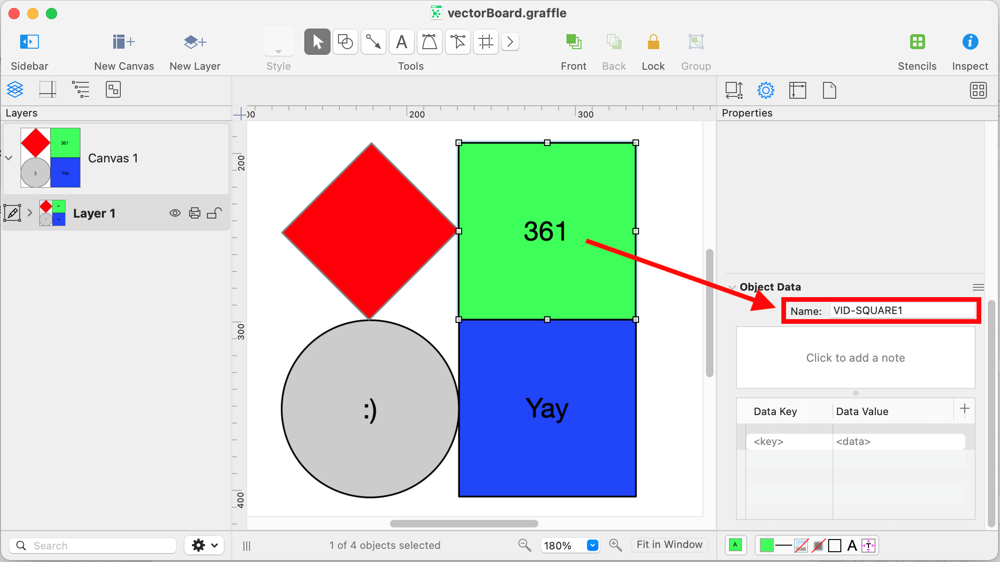
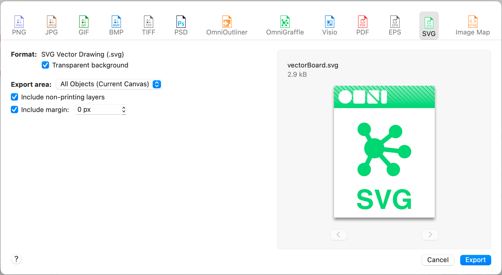

# SVG for web-use patcher

Minimal DOM transformer that patches SVG files exported by OmniGraffle.

## About

Building user interfaces with a vector program like OmniGraffle is fun.  
Yet if your interface is more than static you will need DOM manipulations. Unfortunately this also means you need a reliable way to target individual nodes in your SVG DOM tree. OmniGraffle allows setting IDs, but for whatever reason the programmers decided to disregard the existing way of identifying svg elements (using the ```id``` tag). OmniGraffle only adds a child node named ```title```.
This little program patches SVG files, so the set IDs are where they are supposed to be, *in the node's ```id``` attribute.*  
In addition to that the program patches the default svg dimensions to something so gigantic (5000x5000) that whatever browser using this graphic must apply the css scaling rules you may have enabled.

## How to run

 * ```cd``` into project.
 * replace ```vectorBoard.svg``` by the svg generated with OmniGraffle.
 * Once, add this VM argument as maven default (Allows dynamic loading of xml doctype definitions. This is required to parse the provided svg file.):  
 ```export MAVEN_OPTS="-Djavax.xml.accessExternalDTD=all"```
 * Start the software (make sure ```pom.xml``` is at call location)  
 Replace the ```vectorBoard.svg``` argument by your input svg file.
```mvn clean package exec:java "-Dexec.args=vectorBoard.svg patchedVectorBoard.svg"```
 * The patched svg is stored at: ```patchedVectorBoard.svg```
 
 OR
 
  * Compile the program once with:  
  ```mvn clean package```
  * Then call it from wherever you need it:  
  ```java -Djavax.xml.accessExternalDTD=all -jar target/svgpatcher.jar vectorBoard.svg generatedVectorBoard.svg```

## How it works

Suppose you have tagged an element in Omnigraffle like so:  


You can export it to an svg file, but unfortunately you still need a mechanism to store the ID you typed in the corresponding DOM id attributes:


Otherwise the IDs you set are in the target file, but not where you want them... 

### SVG IDs

Calling this program changes all these patterns:  
```xml
      <g id="Graphic_3">
        <title>VID-SQUARE1</title>
        <rect x="230.8" y="193.9" width="105" height="105" fill="#40ff40"/>
        <rect x="230.8" y="193.9" width="105" height="105" stroke="black" stroke-linecap="round" stroke-linejoin="round" stroke-width="1"/>
        <text transform="translate(235.8 237.176)" fill="black">
          <tspan font-family="Helvetica Neue" font-size="16" font-weight="400" fill="black" x="34.156" y="15">361</tspan>
        </text>
      </g>
```

to:  
```xml
      <g id="VID_SQUARE1">
        <rect x="230.8" y="193.9" width="105" height="105" fill="#40ff40"/>
        <rect x="230.8" y="193.9" width="105" height="105" stroke="black" stroke-linecap="round" stroke-linejoin="round" stroke-width="1"/>
        <text transform="translate(235.8 237.176)" fill="black">
          <tspan font-family="Helvetica Neue" font-size="16" font-weight="400" fill="black" x="34.156" y="15">361</tspan>
        </text>
      </g>
```

### SVG Dimensions

In addition it boosts the svg dimensions to something gigantic:
```xml
<svg [...] width="211.2" height="211.5">
```

is changed to:  
```xml
<svg [...] width="5000" height="5000">
```


## Dependencies

None, this is all built-in Java functionality  :)

## Contact / Pull Requests

 * Author: Maximilian Schiedermeier 
 * Github: Kartoffelquadrat
 * Webpage: https://www.cs.mcgill.ca/~mschie3
 * License: [MIT](https://opensource.org/licenses/MIT)


